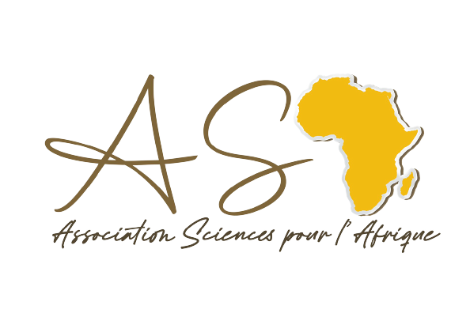

---

---

L'Association Sciences pour l’Afrique est une association apolitique non syndicale et à but non lucratif ayant pour objet de contribuer à la promotion et au développement des sciences en Afrique.

 

Les actions suivantes s'inscrivent dans le cadre de nos activités:

  

• Favoriser la collaboration, le partage d’expériences et
d’informations entre le monde scientifique africain et celui de
l’extérieur en organisant par exemple des séminaires dans
lesquels les chercheurs (les jeunes en priorité) pourront présenter
leurs travaux de recherche ;

  

• Encourager les jeunes africains à s’intéresser davantage aux
sciences en faisant la vulgarisation à travers des exposés sur le
rôle primordial et indispensable des sciences dans le processus de
développement de ce continent avec comme public cible, les plus
jeunes (lycéens et collégiens) ; en organisant des jeux concours
scientifiques créatifs.

  

• Créer un centre de recherche scientifique en Afrique pour
répondre à ses enjeux industriels et contribuer à une formation de
qualité de la jeunesse africaine ; 

